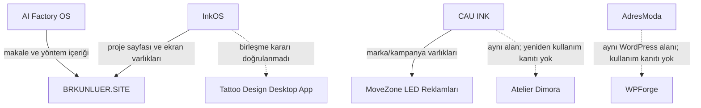

# Proje İlişki Haritası

Yalnız kaynaklarla desteklenen ilişkiler çizilir. Aynı teknoloji veya sektör, tek başına yeniden kullanım kanıtı sayılmaz.

| Kaynak proje | Hedef proje | İlişki | Kanıt |
|---|---|---|---|
| AI Factory OS | BRKUNLUER.SITE | AI Factory Planning Stack makalesi ve AI Factory System yöntem sayfası bu sitede yayımlanıyor. | [S005] [S040] [S041] |
| InkOS | BRKUNLUER.SITE | InkOS, mevcut sitenin proje içeriği ve ekran varlıklarıyla temsil ediliyor. | [S005] [S033] |
| CAU INK | CAU INK x MOVEZONE REKLAM ÇALIŞMALARI | LED reklam çalışması CAU INK marka ve kampanya varlıklarını kullanıyor. | [S014] [S191] [S220] |
| CAU INK | Atelier Dimora | Yalnız aynı tattoo-studio problem alanında tasarım çalışmalarıdır; doğrudan kod/teknik yeniden kullanım kanıtı yoktur. | [S010] [S120] |
| InkOS | Tattoo Design Desktop App | Aynı tattoo-AI alanındadır; arşiv birleşme ihtimalini açık bırakır, bu nedenle ayrı kayıt tutulur. | [S032] [S191] |
| AdresModa | WPForge | Her ikisi WordPress/WooCommerce teslimat alanındadır; WPForge'un AdresModa'da kullanıldığına dair doğrudan kanıt yoktur. | [S051] [S052] [S170] [S171] |

## Açıkça kurulmamış ilişkiler

- AI Factory OS'un InkOS, CAU INK veya diğer ürünleri doğrudan ürettiği doğrulanmadı.
- WPForge'un AdresModa uygulamasında kullanıldığı doğrulanmadı.
- Premium Listing Platform ile OFF İlan Platformu arasında ortak alan dışında kimlik veya kod sürekliliği doğrulanmadı.
